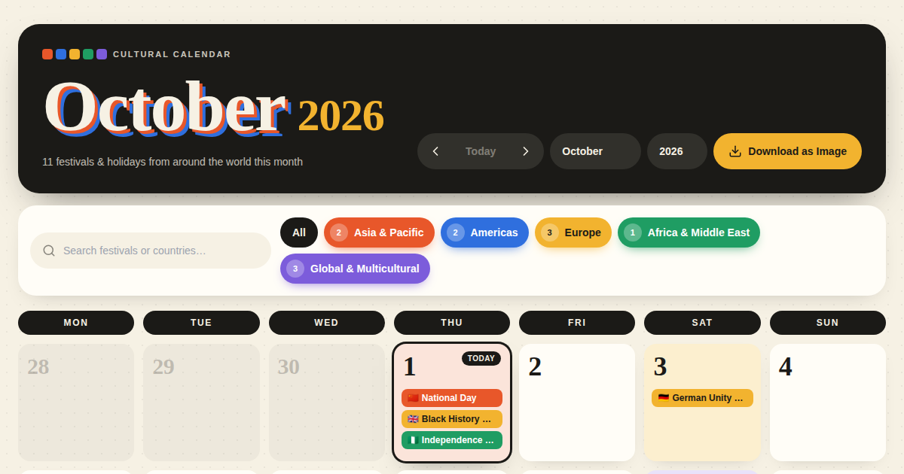

# GlobalBeat — The Interactive Cultural Calendar

GlobalBeat is a visual, interactive calendar of world festivals, regional holidays and global traditions. You can browse month by month, filter by region, search for any festival or country, and download the current month as an image.

It's made for educators, remote teams, travellers and anyone curious about the world.



---

## Features

- **Monthly calendar.** It opens on the current month. You can step back and forward, jump back to **Today**, or pick any month and year from the dropdowns. The ← and → keys also change the month.
- **138 cultural events** in five colour-coded regions:
  - 🟧 Asia & Pacific
  - 🟦 Americas
  - 🟨 Europe
  - 🟩 Africa & Middle East
  - 🟪 Global & Multicultural
- **Correct dates every year.** Fixed dates are simple. Holidays like Easter, Thanksgiving and Notting Hill Carnival are calculated for any year. Lunar festivals such as Lunar New Year, Diwali, Eid and Holi use date tables for 2024–2030.
- **Event cards.** Click any event to see its region and flag, the date, a short overview, and an **Explore Full Story ↗** button that opens Wikipedia in a new tab.
- **Busy days stay tidy.** Each day shows up to three events, plus a **+X more** link that lists the rest.
- **Search and filters.** Type a festival or country name to search the whole year. Region buttons switch each culture on or off.
- **Download as Image.** Saves the current month, including any filters, as a high-resolution PNG named like `cultural-calendar-2026-10.png`.
- **Works on desktop and tablet.** Phones can view it, but event labels get cut short on small screens.

## Tech stack

| Part | Tool |
| --- | --- |
| UI | [React 18](https://react.dev) |
| Build tool | [Vite 5](https://vitejs.dev) |
| Styling | [Tailwind CSS 3](https://tailwindcss.com) |
| Icons | [Lucide](https://lucide.dev) |
| Fonts | Fraunces and Space Grotesk, from [Google Fonts](https://fonts.google.com) |
| Hosting | [Vercel](https://vercel.com) |

There's no backend, database or API key. The whole site is static files, so hosting on Vercel's free plan is enough.

## Project structure

```
globalbeat/
├── index.html              ← page title, description, icon and social preview tags
├── package.json            ← project name, scripts and dependencies
├── package-lock.json       ← exact dependency versions (keep this file)
├── vite.config.js          ← build settings
├── tailwind.config.js      ← tells Tailwind where to find class names
├── postcss.config.js       ← connects Tailwind to the build
├── public/
│   ├── favicon.svg         ← browser tab icon
│   └── og-image.png        ← preview image for social media links
└── src/
    ├── main.jsx            ← starts the app
    ├── index.css           ← loads Tailwind
    └── CulturalCalendar.jsx  ← the whole calendar: data, layout and logic
```

